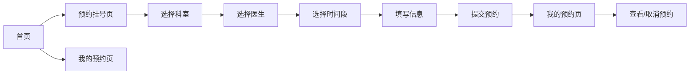

## 1. 产品概述

宠物医院在线预约系统，为宠物主人提供便捷的在线预约挂号服务，解决传统电话预约排队等待的问题。
- 主要用途：宠物主人在线浏览医院信息、选择科室和医生、预约就诊时间段、管理个人预约记录
- 目标用户：养宠人士、宠物主人
- 产品价值：提升预约效率，优化就医体验，减少现场等待时间

## 2. 核心功能

### 2.1 用户角色

| 角色 | 注册方式 | 核心权限 |
|------|---------|---------|
| 普通用户 | 无需注册，本地存储 | 浏览医院信息、预约挂号、查看和取消预约 |

### 2.2 功能模块

1. **首页**：医院介绍、热门科室展示、快速预约入口
2. **预约挂号页**：科室选择、医生选择、时间段选择、预约表单提交
3. **我的预约页**：预约记录列表、预约详情查看、取消预约

### 2.3 页面详情

| 页面名称 | 模块名称 | 功能描述 |
|---------|---------|---------|
| 首页 | 医院介绍 | 展示医院简介、特色服务、医院环境图片 |
| 首页 | 热门科室 | 卡片式展示各科室信息，点击可跳转预约 |
| 首页 | 顶部导航 | 切换首页/预约挂号/我的预约页面 |
| 预约挂号页 | 科室选择 | 展示所有科室，点击选择后显示对应医生 |
| 预约挂号页 | 医生选择 | 展示所选科室的医生列表，包含头像、姓名、职称、简介 |
| 预约挂号页 | 时间段选择 | 展示可预约日期和时间段，灰色显示已约满 |
| 预约挂号页 | 预约表单 | 填写宠物信息、联系方式、病情描述 |
| 我的预约页 | 预约列表 | 按时间排序展示所有预约记录，显示状态 |
| 我的预约页 | 取消预约 | 支持取消待就诊的预约 |

## 3. 核心流程

用户访问首页 → 浏览医院介绍和科室 → 点击科室或导航进入预约挂号页 → 选择科室 → 选择医生 → 选择预约日期和时间段 → 填写预约信息 → 提交预约 → 跳转至我的预约页查看预约记录 → 可选择取消预约

## 4. 用户界面设计

### 4.1 设计风格
- 主色调：浅蓝色（#E3F2FD、#2196F3、#1976D2）
- 辅助色：白色（#FFFFFF）
- 按钮风格：圆角矩形，浅蓝色背景，悬停变深蓝
- 字体：使用 Google Fonts 的 "Noto Sans SC" 中文字体
- 布局风格：卡片式布局，圆角 16px，柔和阴影
- 图标风格：使用简洁线性图标，emoji 增强亲切感

### 4.2 页面设计概述

| 页面名称 | 模块名称 | UI 元素 |
|---------|---------|---------|
| 首页 | Hero 区域 | 全屏宽度，渐变背景，医院名称和标语，圆角卡片 |
| 首页 | 医院介绍 | 图文混排，左右布局，柔和阴影卡片 |
| 首页 | 热门科室 | 网格布局，科室卡片带图标，悬停动画效果 |
| 预约挂号页 | 步骤指示器 | 顶部显示当前选择进度（科室→医生→时间→信息） |
| 预约挂号页 | 选择卡片 | 选中状态蓝色边框高亮，未选中浅灰边框 |
| 预约挂号页 | 时间段 | 网格排列，可选/已选/禁用三种状态 |
| 我的预约页 | 预约卡片 | 显示预约详情，状态标签（待就诊/已完成/已取消） |
| 我的预约页 | 取消按钮 | 红色边框，点击弹出确认对话框 |

### 4.3 响应式
- 桌面优先设计，最小支持 1440px 宽度
- 移动端自适应，断点 768px，单列布局
- 触摸区域最小 48x48px，适合移动端操作

### 4.4 动画效果
- 页面切换：淡入淡出过渡
- 卡片悬停：向上浮动 + 阴影加深
- 按钮点击：缩放反馈
- 状态变化：平滑过渡动画
