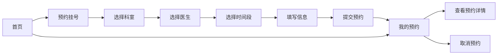

## 1. 产品概述

宠物医院在线预约系统，为宠物主人提供便捷的在线挂号预约服务，解决传统电话预约排队久、信息不透明的问题，提升就诊体验和医院运营效率。

## 2. 核心功能

### 2.1 用户角色

| 角色 | 注册方式 | 核心权限 |
|------|----------|----------|
| 宠物主人 | 无需注册（访客模式） | 浏览医院信息、预约挂号、查看/取消预约 |

### 2.2 功能模块

1. **首页**：医院介绍、热门科室展示、快速预约入口
2. **预约挂号**：科室选择、医生选择、时间段选择、预约信息填写与提交
3. **我的预约**：预约记录列表、预约详情查看、取消预约

### 2.3 页面详情

| 页面名称 | 模块名称 | 功能描述 |
|----------|----------|----------|
| 首页 | 医院介绍 | 展示医院简介、特色服务、医院环境 |
| 首页 | 热门科室 | 展示热门科室卡片，点击可跳转预约 |
| 首页 | 快捷入口 | 快速预约按钮，引导用户进入挂号流程 |
| 预约挂号 | 科室选择 | 展示所有科室列表，支持选择科室 |
| 预约挂号 | 医生选择 | 根据选择的科室展示对应医生列表 |
| 预约挂号 | 时间段选择 | 展示可预约日期和时间段 |
| 预约挂号 | 信息填写 | 填写宠物信息、主人联系方式 |
| 预约挂号 | 提交预约 | 确认预约信息并提交 |
| 我的预约 | 预约列表 | 展示所有预约记录，按状态分类 |
| 我的预约 | 预约详情 | 展示预约的详细信息 |
| 我的预约 | 取消预约 | 支持取消待就诊的预约 |

## 3. 核心流程

用户从首页进入，可浏览医院介绍和热门科室；点击预约挂号后，依次选择科室、医生、时间段，填写宠物和主人信息后提交预约；在我的预约页面可查看所有预约记录，并可取消未就诊的预约。

## 4. 用户界面设计

### 4.1 设计风格

- **主色调**：浅蓝色（#3B82F6 / #60A5FA），搭配白色背景
- **辅助色**：浅蓝渐变、柔和阴影
- **按钮风格**：圆角按钮，悬停有微动画效果
- **字体**：使用现代无衬线字体，清晰易读
- **布局风格**：卡片式布局，大圆角设计，柔和阴影
- **图标风格**：线性图标，轻盈简洁
- **整体氛围**：温馨、专业、值得信赖

### 4.2 页面设计概览

| 页面名称 | 模块名称 | UI 元素 |
|----------|----------|---------|
| 首页 | Hero区域 | 大标题、副标题、CTA按钮、渐变背景 |
| 首页 | 医院介绍 | 图标+文字卡片、特性展示 |
| 首页 | 热门科室 | 科室卡片网格、图标、名称、简介 |
| 预约挂号 | 步骤导航 | 步骤指示器、当前步骤高亮 |
| 预约挂号 | 选择卡片 | 可点击卡片、选中状态高亮 |
| 预约挂号 | 表单输入 | 圆角输入框、标签、错误提示 |
| 我的预约 | 预约卡片 | 状态标签、医院信息、时间、操作按钮 |

### 4.3 响应式设计

- 桌面端优先设计
- 移动端自适应布局
- 触摸友好的按钮和交互元素
- 卡片在移动端堆叠展示

