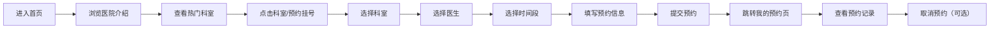

## 1. 产品概述
宠物医院在线预约系统，为宠物主人提供便捷的在线挂号服务，解决传统电话预约繁琐、信息不透明的问题。
- 主要面向养宠人士，提供医院介绍浏览、科室医生选择、时间段预约、预约管理等一站式服务
- 提升宠物医院的服务效率，优化用户就诊体验

## 2. 核心功能

### 2.1 用户角色
| 角色 | 注册方式 | 核心权限 |
|------|---------|---------|
| 宠物主人 | 无需登录（本地存储） | 浏览医院信息、选择科室医生、预约挂号、查看/取消预约记录 |

### 2.2 功能模块
1. **首页**：医院介绍Hero区、热门科室展示
2. **预约挂号页**：科室选择、医生选择、时间段选择、预约表单提交
3. **我的预约页**：预约记录列表、预约详情、取消预约

### 2.3 页面详情
| 页面名称 | 模块名称 | 功能描述 |
|---------|---------|----------|
| 首页 | Hero区 | 医院名称、标语、背景图、快速预约按钮 |
| 首页 | 医院介绍 | 医院简介、特色服务、核心优势卡片展示 |
| 首页 | 热门科室 | 科室卡片网格，展示科室名称、图标、简介，点击跳转预约页 |
| 预约挂号页 | 科室选择 | 科室列表，单选，选中后加载对应医生 |
| 预约挂号页 | 医生选择 | 医生卡片，展示头像、姓名、职称、擅长，单选 |
| 预约挂号页 | 时间段选择 | 日期选择 + 时段网格，可预约/已约满状态区分 |
| 预约挂号页 | 预约表单 | 宠物信息、联系人、手机号、备注，提交预约 |
| 我的预约页 | 预约列表 | 按时间排序，展示预约状态、科室、医生、时间 |
| 我的预约页 | 取消预约 | 确认弹窗，取消后状态更新为已取消 |

## 3. 核心流程
用户进入首页浏览医院介绍和科室，选择科室后跳转至预约挂号页，依次选择科室、医生、时间段，填写宠物信息和联系方式，提交预约成功后可在我的预约页查看或取消预约。

## 4. 用户界面设计

### 4.1 设计风格
- 主色调：浅蓝色（#E0F2FE / #38BDF8），辅助色：白色，强调色：天蓝（#0EA5E9）
- 按钮风格：圆角矩形，浅蓝色填充，悬停时加深颜色，平滑过渡动画
- 字体：系统无衬线字体，标题加粗，正文清晰易读
- 布局风格：圆角卡片（16px圆角），卡片阴影柔和，间距充足，顶部导航栏固定
- 图标风格：使用 lucide-react 线性图标，统一尺寸和风格

### 4.2 页面设计概述
| 页面名称 | 模块名称 | UI元素 |
|---------|---------|--------|
| 首页 | Hero区 | 全屏宽度，渐变背景，大标题，居中CTA按钮，淡入动画 |
| 首页 | 医院介绍 | 3列卡片网格，图标+标题+描述，悬停上浮效果 |
| 首页 | 热门科室 | 4列卡片网格，彩色图标背景，科室名称简介，点击跳转 |
| 预约挂号页 | 选择器 | 步骤指示器，横向排列选择项，选中状态高亮 |
| 预约挂号页 | 时间段 | 日期横向滚动，时段网格按钮，可用/禁用状态区分 |
| 预约挂号页 | 表单 | 分组输入框，圆角边框，输入聚焦高亮，提交按钮 |
| 我的预约页 | 列表 | 纵向卡片列表，状态标签颜色区分，操作按钮右对齐 |

### 4.3 响应式
- 桌面端优先设计（1024px+）
- 平板端（768px-1024px）：卡片网格调整为3列/2列
- 移动端（<768px）：单列布局，导航栏简化，触摸区域增大
- 所有交互元素最小44px触摸区域

### 4.4 动画与交互
- 页面切换：淡入过渡效果
- 卡片悬停：轻微上浮 + 阴影加深
- 按钮点击：缩放反馈
- 表单验证：错误提示平滑显示
- 加载状态：骨架屏或脉冲动画
