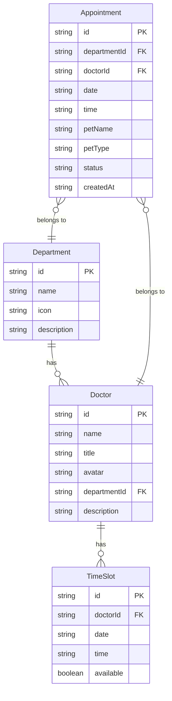

## 1. 架构设计

```mermaid
graph TB
    "前端 React SPA" --> "Zustand 状态管理"
    "Zustand 状态管理" --> "Mock 数据层"
```

纯前端项目，使用 Zustand 管理全局预约状态，数据存储在内存中（Mock 数据），无需后端服务。

## 2. 技术说明

- 前端：React@18 + TypeScript + Tailwind CSS@3 + Vite
- 初始化工具：vite-init（react-ts 模板）
- 后端：无
- 数据库：无，使用 Mock 数据

## 3. 路由定义

| 路由 | 用途 |
|------|------|
| / | 首页，展示医院介绍和热门科室 |
| /appointment | 预约挂号页，选择科室/医生/时间段并提交 |
| /my-appointments | 我的预约页，查看预约记录和取消预约 |

## 4. API 定义

不适用（纯前端项目）

## 5. 服务端架构图

不适用（纯前端项目）

## 6. 数据模型

### 6.1 数据模型定义



### 6.2 数据定义语言

使用 TypeScript 类型定义代替 DDL：

```typescript
interface Department {
  id: string;
  name: string;
  icon: string;
  description: string;
}

interface Doctor {
  id: string;
  name: string;
  title: string;
  avatar: string;
  departmentId: string;
  description: string;
}

interface TimeSlot {
  id: string;
  doctorId: string;
  date: string;
  time: string;
  available: boolean;
}

type AppointmentStatus = 'pending' | 'confirmed' | 'cancelled';

interface Appointment {
  id: string;
  departmentId: string;
  doctorId: string;
  date: string;
  time: string;
  petName: string;
  petType: string;
  status: AppointmentStatus;
  createdAt: string;
}
```
