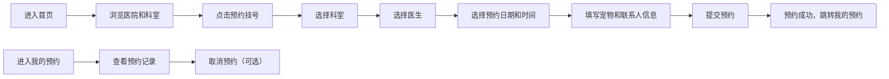

## 1. 产品概述
宠物医院在线预约系统，为宠物主人提供便捷的兽医预约服务。
- 主要用途：帮助宠物主人在线浏览医院信息、选择科室和医生、预约就诊时间，并管理个人预约记录
- 目标用户：养宠家庭、宠物主人
- 产品价值：简化预约流程，减少等待时间，提升宠物就医体验

## 2. 核心功能

### 2.1 用户角色
| 角色 | 注册方式 | 核心权限 |
|------|----------|----------|
| 宠物主人 | 无需注册，本地存储 | 浏览医院信息、预约挂号、查看和取消预约 |

### 2.2 功能模块
1. **首页**：医院介绍、热门科室展示、快速预约入口
2. **预约挂号**：科室选择、医生选择、时间段选择、预约信息填写与提交
3. **我的预约**：预约记录列表、预约详情查看、取消预约功能

### 2.3 页面详情
| 页面名称 | 模块名称 | 功能描述 |
|----------|----------|----------|
| 首页 | 医院介绍 | 展示医院简介、特色服务、联系方式 |
| 首页 | 热门科室 | 卡片式展示各科室，点击可跳转预约 |
| 预约挂号 | 科室选择 | 展示所有科室列表，支持选择 |
| 预约挂号 | 医生选择 | 根据所选科室展示对应医生 |
| 预约挂号 | 时间选择 | 展示可预约时间段，支持日期和时段选择 |
| 预约挂号 | 预约提交 | 填写宠物信息和联系方式，提交预约 |
| 我的预约 | 预约列表 | 展示所有预约记录，按状态分类 |
| 我的预约 | 取消预约 | 支持取消待就诊的预约 |

## 3. 核心流程

## 4. 用户界面设计

### 4.1 设计风格
- **主色调**：浅蓝色（#E0F2FE、#7DD3FC、#0EA5E9），搭配白色背景
- **辅色调**：深蓝（#0369A1）用于强调和按钮
- **圆角**：卡片圆角 16px，按钮圆角 12px
- **字体**：使用系统无衬线字体，标题加粗
- **布局风格**：卡片式布局，顶部导航栏，内容区域居中
- **图标**：使用 lucide-react 图标库，与医疗、宠物相关图标

### 4.2 页面设计概览
| 页面名称 | 模块名称 | UI 元素 |
|----------|----------|----------|
| 首页 | 导航栏 | 浅蓝色背景，白色文字，hover 效果 |
| 首页 | Hero 区域 | 大标题、医院标语、快速预约按钮 |
| 首页 | 医院介绍 | 大卡片，包含图标和文字说明 |
| 首页 | 热门科室 | 网格布局卡片，每个卡片有图标和科室名称 |
| 预约挂号 | 步骤指示器 | 显示当前选择进度（科室→医生→时间→确认） |
| 预约挂号 | 选择卡片 | 可点击的选择项，选中状态高亮 |
| 预约挂号 | 时间网格 | 日期选择器 + 时间段按钮网格 |
| 我的预约 | 预约卡片 | 展示预约详情，包含状态标签、取消按钮 |

### 4.3 响应式
- 采用桌面优先设计，适配移动端
- 内容区域最大宽度 1200px，居中显示
- 移动端导航栏改为汉堡菜单
- 卡片网格在移动端改为单列布局
- 触摸设备优化按钮尺寸（最小 44px）
