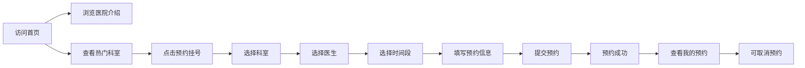

## 1. 产品概述

宠物医院在线预约系统，为宠物主人提供便捷的在线预约挂号服务，解决传统电话预约排队难、信息不透明的问题，提升宠物就医体验。

- 主要用途：宠物主人在线浏览医院信息、选择科室和医生、预约就诊时间段、管理个人预约记录
- 目标用户：养宠物的家庭用户
- 产品价值：提升预约效率、优化用户体验、减少医院前台工作压力

## 2. 核心功能

### 2.1 用户角色
| 角色 | 注册方式 | 核心权限 |
|------|---------|---------|
| 宠物主人 | 无需注册（本地存储） | 浏览医院信息、预约挂号、查看和取消预约 |

### 2.2 功能模块
1. **首页**：医院介绍、热门科室展示、快捷预约入口
2. **预约挂号页**：科室选择、医生选择、时间段选择、预约信息填写、提交预约
3. **我的预约页**：预约记录列表、预约详情查看、取消预约

### 2.3 页面详情
| 页面名称 | 模块名称 | 功能描述 |
|---------|---------|----------|
| 首页 | 医院介绍 | 展示医院简介、特色服务、营业时间、联系方式 |
| 首页 | 热门科室 | 卡片式展示各科室信息，点击可跳转预约 |
| 首页 | 快捷入口 | 导航至预约挂号和我的预约 |
| 预约挂号页 | 科室选择 | 展示所有科室，点击选择科室 |
| 预约挂号页 | 医生选择 | 根据所选科室展示对应医生列表 |
| 预约挂号页 | 时间段选择 | 展示可预约日期和时间段 |
| 预约挂号页 | 信息填写 | 填写宠物信息和主人联系方式 |
| 预约挂号页 | 提交预约 | 验证信息并提交预约 |
| 我的预约页 | 预约列表 | 展示所有预约记录，按时间排序 |
| 我的预约页 | 预约详情 | 展示预约的完整信息 |
| 我的预约页 | 取消预约 | 点击取消未就诊的预约 |

## 3. 核心流程

用户访问首页 → 浏览医院信息和科室 → 点击预约挂号 → 选择科室 → 选择医生 → 选择日期和时间段 → 填写宠物和主人信息 → 提交预约 → 查看预约记录 → 可取消预约

## 4. 用户界面设计

### 4.1 设计风格
- **主色调**：浅蓝色（#3B82F6），代表专业、安心、清爽
- **辅助色**：白色（#FFFFFF）背景，营造干净卫生的医疗环境感
- **强调色**：浅蓝色渐变，用于按钮和重要操作
- **按钮风格**：圆角矩形，浅蓝色背景，hover 时颜色加深
- **卡片风格**：大圆角（16px），白色背景，浅蓝色边框或柔和阴影
- **字体**：使用系统无衬线字体，标题加粗，正文清晰易读
- **布局**：顶部导航栏固定，内容区居中展示，卡片式网格布局
- **图标**：使用 lucide-react 图标库，简洁线性风格

### 4.2 页面设计概述
| 页面名称 | 模块名称 | UI 元素 |
|---------|---------|---------|
| 首页 | 医院介绍 | 大标题、描述文本、特色标签、图标展示 |
| 首页 | 热门科室 | 圆角卡片网格、科室图标、科室名称、简介 |
| 预约挂号页 | 步骤导航 | 步骤指示器，显示当前进度 |
| 预约挂号页 | 选择区域 | 卡片式选择项，选中状态高亮 |
| 预约挂号页 | 表单区域 | 圆角输入框，标签清晰 |
| 我的预约页 | 预约卡片 | 时间线布局，状态标签，操作按钮 |

### 4.3 响应式设计
- 采用桌面优先设计，自适应适配平板和移动端
- 卡片网格在移动端变为单列布局
- 导航栏在移动端可折叠
- 触摸区域不小于 44x44px，优化移动端点击体验

### 4.4 动效设计
- 页面切换时淡入淡出过渡
- 卡片 hover 时轻微上浮和阴影加深
- 按钮点击有缩放反馈
- 表单验证错误有抖动提示
- 预约成功有成功动画
