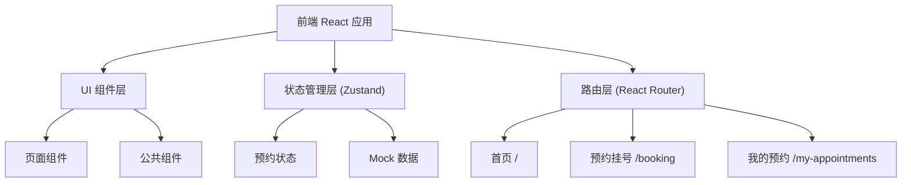

## 1. 架构设计



## 2. 技术描述

- 前端框架：React 18 + TypeScript
- 构建工具：Vite
- 路由管理：react-router-dom v6
- 状态管理：zustand
- UI样式：Tailwind CSS 3
- 图标库：lucide-react
- 后端：无（纯前端，使用 localStorage + Mock 数据）
- 数据持久化：localStorage

## 3. 路由定义

| 路由路径 | 页面名称 | 文件位置 |
|---------|---------|----------|
| `/` | 首页 | src/pages/Home.tsx |
| `/booking` | 预约挂号 | src/pages/Booking.tsx |
| `/my-appointments` | 我的预约 | src/pages/MyAppointments.tsx |
| `*` | 404重定向至首页 | - |

## 4. 数据模型

### 4.1 数据类型定义

```typescript
// 科室
interface Department {
  id: string;
  name: string;
  icon: string;
  description: string;
  color: string;
}

// 医生
interface Doctor {
  id: string;
  name: string;
  title: string;
  departmentId: string;
  specialty: string;
  avatar: string;
  experience: number;
}

// 时间段
interface TimeSlot {
  id: string;
  date: string;
  time: string;
  available: boolean;
}

// 预约记录
interface Appointment {
  id: string;
  departmentId: string;
  doctorId: string;
  date: string;
  time: string;
  petName: string;
  petType: string;
  petAge: number;
  ownerName: string;
  phone: string;
  notes: string;
  status: 'pending' | 'completed' | 'cancelled';
  createdAt: string;
}

// 预约状态
interface BookingState {
  selectedDepartment: Department | null;
  selectedDoctor: Doctor | null;
  selectedDate: string | null;
  selectedTimeSlot: TimeSlot | null;
  appointments: Appointment[];
  setSelectedDepartment: (dept: Department | null) => void;
  setSelectedDoctor: (doctor: Doctor | null) => void;
  setSelectedDate: (date: string | null) => void;
  setSelectedTimeSlot: (slot: TimeSlot | null) => void;
  addAppointment: (appt: Omit<Appointment, 'id' | 'status' | 'createdAt'>) => void;
  cancelAppointment: (id: string) => void;
  resetSelection: () => void;
}
```

### 4.2 Mock 数据

```typescript
// 科室数据
const departments: Department[] = [
  { id: '1', name: '内科', icon: 'Heart', description: '宠物内科疾病诊治', color: '#38BDF8' },
  { id: '2', name: '外科', icon: 'Scissors', description: '各类手术及外伤处理', color: '#0EA5E9' },
  { id: '3', name: '皮肤科', icon: 'Sparkles', description: '皮肤疾病与美容', color: '#06B6D4' },
  { id: '4', name: '牙科', icon: 'Tooth', description: '口腔健康与牙科手术', color: '#0891B2' },
  { id: '5', name: '眼科', icon: 'Eye', description: '眼部疾病诊治', color: '#0284C7' },
  { id: '6', name: '体检中心', icon: 'ClipboardList', description: '全面健康检查', color: '#7DD3FC' },
  { id: '7', name: '急诊', icon: 'AlertCircle', description: '24小时急诊服务', color: '#F87171' },
  { id: '8', name: '疫苗接种', icon: 'Syringe', description: '各类疫苗接种', color: '#34D399' },
];

// 医生数据
const doctors: Doctor[] = [
  { id: 'd1', name: '张医生', title: '主任医师', departmentId: '1', specialty: '犬猫内科疾病', avatar: '', experience: 15 },
  { id: 'd2', name: '李医生', title: '副主任医师', departmentId: '1', specialty: '消化系统疾病', avatar: '', experience: 10 },
  { id: 'd3', name: '王医生', title: '主治医师', departmentId: '2', specialty: '软组织外科', avatar: '', experience: 8 },
  { id: 'd4', name: '刘医生', title: '主任医师', departmentId: '2', specialty: '骨科手术', avatar: '', experience: 12 },
  // ... 更多医生
];
```

## 5. 项目结构

```
src/
├── components/          # 公共组件
│   ├── Navbar.tsx       # 顶部导航栏
│   ├── DepartmentCard.tsx   # 科室卡片
│   ├── DoctorCard.tsx       # 医生卡片
│   ├── TimeSlotPicker.tsx   # 时间段选择器
│   ├── AppointmentCard.tsx  # 预约卡片
│   └── StepIndicator.tsx    # 步骤指示器
├── pages/               # 页面组件
│   ├── Home.tsx         # 首页
│   ├── Booking.tsx      # 预约挂号页
│   └── MyAppointments.tsx   # 我的预约页
├── store/               # 状态管理
│   └── useBookingStore.ts   # Zustand store
├── data/                # Mock数据
│   └── mockData.ts      # 科室、医生数据
├── types/               # 类型定义
│   └── index.ts         # 全局类型
├── App.tsx              # 根组件
├── main.tsx             # 入口文件
└── index.css            # 全局样式（含Tailwind配置）
```

## 6. 核心组件设计

### 6.1 Navbar 导航栏
- 固定顶部，白色背景，底部阴影
- Logo + 医院名称
- 导航链接：首页、预约挂号、我的预约
- 当前激活状态高亮显示

### 6.2 DepartmentCard 科室卡片
- 圆角 16px，白色背景，柔和阴影
- 左侧彩色图标背景，右侧科室名称和描述
- 悬停时轻微上浮，阴影加深
- 点击跳转至预约页并自动选中该科室

### 6.3 DoctorCard 医生卡片
- 显示医生头像、姓名、职称、经验年限、擅长领域
- 选中状态边框高亮
- 悬停效果

### 6.4 TimeSlotPicker 时间段选择器
- 日期横向滚动选择（未来7天）
- 时段网格（上午/下午各时段）
- 可预约/已约满状态区分
- 选中状态高亮

### 6.5 AppointmentCard 预约卡片
- 预约状态标签（待就诊/已完成/已取消）
- 科室、医生、预约时间信息
- 宠物信息展示
- 取消预约按钮（仅待就诊状态显示）

## 7. 样式配置

### Tailwind 主题扩展
```javascript
theme: {
  extend: {
    colors: {
      primary: {
        50: '#F0F9FF',
        100: '#E0F2FE',
        200: '#BAE6FD',
        300: '#7DD3FC',
        400: '#38BDF8',
        500: '#0EA5E9',
        600: '#0284C7',
        700: '#0369A1',
      },
    },
    borderRadius: {
      'xl': '16px',
      '2xl': '20px',
    },
    boxShadow: {
      'card': '0 4px 20px rgba(0, 0, 0, 0.06)',
      'card-hover': '0 8px 30px rgba(0, 0, 0, 0.1)',
    },
  },
}
```
