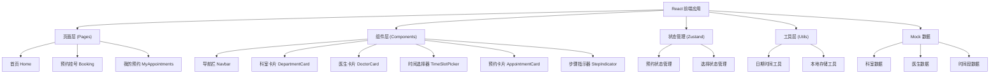

## 1. 架构设计



## 2. 技术描述

- **前端框架**：React 18 + TypeScript
- **构建工具**：Vite 5
- **样式方案**：Tailwind CSS 3
- **状态管理**：Zustand
- **路由管理**：React Router DOM 6
- **图标库**：lucide-react
- **数据存储**：localStorage（前端持久化）
- **初始化工具**：vite-init

## 3. 路由定义

| 路由 | 页面 | 用途 |
|------|------|------|
| / | 首页 | 医院介绍、热门科室展示 |
| /booking | 预约挂号 | 选择科室、医生、时间段，提交预约 |
| /my-appointments | 我的预约 | 查看预约记录、取消预约 |

## 4. 数据模型

### 4.1 数据模型定义

```mermaid
erDiagram
    DEPARTMENT {
        string id "科室ID"
        string name "科室名称"
        string description "科室描述"
        string icon "图标名称"
    }
    
    DOCTOR {
        string id "医生ID"
        string name "医生姓名"
        string departmentId "所属科室ID"
        string title "职称"
        string avatar "头像"
        string description "医生简介"
    }
    
    TIME_SLOT {
        string id "时段ID"
        string date "日期"
        string time "时间"
        boolean available "是否可预约"
    }
    
    APPOINTMENT {
        string id "预约ID"
        string departmentId "科室ID"
        string doctorId "医生ID"
        string date "预约日期"
        string time "预约时间"
        string petName "宠物名称"
        string petType "宠物类型"
        string ownerName "主人姓名"
        string phone "联系电话"
        string status "状态: pending/cancelled/completed"
        string createdAt "创建时间"
    }
    
    DEPARTMENT ||--o{ DOCTOR : "包含"
    DOCTOR ||--o{ APPOINTMENT : "被预约"
    APPOINTMENT }--|| DEPARTMENT : "所属"
```

### 4.2 TypeScript 类型定义

```typescript
interface Department {
  id: string;
  name: string;
  description: string;
  icon: string;
}

interface Doctor {
  id: string;
  name: string;
  departmentId: string;
  title: string;
  avatar: string;
  description: string;
}

interface TimeSlot {
  id: string;
  date: string;
  time: string;
  available: boolean;
}

interface Appointment {
  id: string;
  departmentId: string;
  doctorId: string;
  date: string;
  time: string;
  petName: string;
  petType: string;
  ownerName: string;
  phone: string;
  status: 'pending' | 'cancelled' | 'completed';
  createdAt: string;
}

interface BookingState {
  selectedDepartment: Department | null;
  selectedDoctor: Doctor | null;
  selectedDate: string | null;
  selectedTime: string | null;
  appointments: Appointment[];
}
```

## 5. 项目目录结构

```
src/
├── components/          # 公共组件
│   ├── Navbar.tsx
│   ├── DepartmentCard.tsx
│   ├── DoctorCard.tsx
│   ├── TimeSlotPicker.tsx
│   ├── AppointmentCard.tsx
│   └── StepIndicator.tsx
├── pages/               # 页面组件
│   ├── Home.tsx
│   ├── Booking.tsx
│   └── MyAppointments.tsx
├── store/               # 状态管理
│   └── useBookingStore.ts
├── data/                # Mock 数据
│   ├── departments.ts
│   ├── doctors.ts
│   └── timeSlots.ts
├── utils/               # 工具函数
│   ├── dateUtils.ts
│   └── storage.ts
├── types/               # 类型定义
│   └── index.ts
├── App.tsx
├── main.tsx
└── index.css
```
