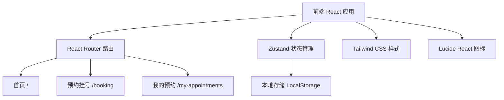

## 1. 架构设计



## 2. 技术描述

- **前端框架**：React@18 + TypeScript
- **构建工具**：Vite@5
- **路由管理**：react-router-dom@6
- **状态管理**：zustand@4
- **样式方案**：Tailwind CSS@3
- **图标库**：lucide-react
- **数据持久化**：浏览器 LocalStorage（模拟后端存储）
- **后端服务**：无（纯前端项目，使用 Mock 数据）

## 3. 路由定义

| 路由路径 | 页面名称 | 用途 |
|---------|---------|------|
| `/` | 首页 | 展示医院介绍和热门科室 |
| `/booking` | 预约挂号页 | 选择科室、医生、时间段，提交预约 |
| `/my-appointments` | 我的预约页 | 查看预约记录，取消预约 |

## 4. 数据模型

### 4.1 数据类型定义

```typescript
// 科室
interface Department {
  id: string;
  name: string;
  icon: string;
  description: string;
  isHot: boolean;
}

// 医生
interface Doctor {
  id: string;
  name: string;
  departmentId: string;
  title: string;
  avatar: string;
  description: string;
}

// 时间段
interface TimeSlot {
  id: string;
  date: string;
  time: string;
  available: boolean;
}

// 预约记录
interface Appointment {
  id: string;
  departmentId: string;
  departmentName: string;
  doctorId: string;
  doctorName: string;
  date: string;
  time: string;
  petName: string;
  petType: string;
  ownerName: string;
  ownerPhone: string;
  status: 'pending' | 'completed' | 'cancelled';
  createdAt: string;
}

// 预约状态
type BookingStep = 'department' | 'doctor' | 'time' | 'info' | 'success';
```

### 4.2 Mock 数据

- 科室数据：内科、外科、皮肤科、眼科、牙科、影像科、检验科、中兽医科
- 医生数据：每个科室 2-3 名医生
- 时间段数据：未来 7 天，每天 8:00-18:00，每小时一个时间段

### 4.3 状态管理

使用 Zustand 创建预约 store：
- 存储当前预约流程的选择状态
- 存储历史预约记录
- 提供预约提交、取消等操作方法
- 数据持久化到 LocalStorage

## 5. 项目结构

```
src/
├── components/          # 公共组件
│   ├── Navbar.tsx      # 顶部导航栏
│   ├── DepartmentCard.tsx  # 科室卡片
│   ├── DoctorCard.tsx      # 医生卡片
│   ├── TimeSlotCard.tsx    # 时间段卡片
│   ├── AppointmentCard.tsx # 预约记录卡片
│   └── StepIndicator.tsx   # 步骤指示器
├── pages/              # 页面组件
│   ├── Home.tsx       # 首页
│   ├── Booking.tsx    # 预约挂号页
│   └── MyAppointments.tsx  # 我的预约页
├── store/             # 状态管理
│   └── useBookingStore.ts
├── data/              # Mock 数据
│   ├── departments.ts
│   ├── doctors.ts
│   └── timeSlots.ts
├── types/             # TypeScript 类型定义
│   └── index.ts
├── utils/             # 工具函数
│   └── storage.ts
├── App.tsx            # 根组件
├── main.tsx           # 入口文件
└── index.css          # 全局样式
```

## 6. 核心功能实现

### 6.1 预约流程
1. 科室选择：点击科室卡片，高亮选中状态，进入医生选择
2. 医生选择：根据科室过滤医生，点击选择医生
3. 时间选择：展示可预约日期和时间段，不可选时间段置灰
4. 信息填写：表单验证宠物信息和联系方式
5. 提交预约：生成预约记录，保存到 store 和 localStorage

### 6.2 预约管理
- 按时间倒序展示预约记录
- 显示预约状态（待就诊、已完成、已取消）
- 待就诊预约可取消，取消后更新状态
- 超过预约时间自动标记为已完成

### 6.3 样式规范
- 主色调：`#3B82F6` (blue-500)
- 浅蓝背景：`#EFF6FF` (blue-50)
- 边框色：`#BFDBFE` (blue-200)
- 圆角：`16px` 用于卡片，`12px` 用于按钮，`8px` 用于输入框
- 阴影：柔和的浅蓝阴影 `0 4px 20px rgba(59, 130, 246, 0.1)`
