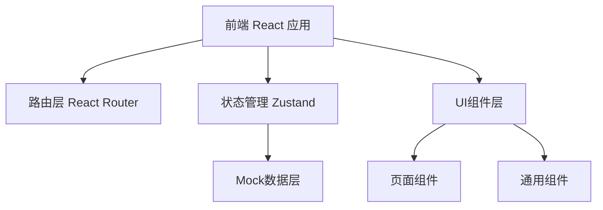

## 1. 架构设计



## 2. 技术说明

- **前端框架**：React@18 + TypeScript
- **构建工具**：Vite
- **样式方案**：Tailwind CSS 3
- **路由管理**：react-router-dom
- **状态管理**：zustand
- **图标库**：lucide-react
- **后端**：无（纯前端，使用 Mock 数据）
- **数据存储**：localStorage 持久化预约数据

## 3. 路由定义

| 路由 | 页面 | 说明 |
|------|------|------|
| / | 首页 | 医院介绍、热门科室 |
| /appointment | 预约挂号 | 科室、医生、时间选择 |
| /my-appointments | 我的预约 | 预约记录管理 |

## 4. 数据模型

### 4.1 科室 (Department)

```typescript
interface Department {
  id: string;
  name: string;
  icon: string;
  description: string;
  isHot: boolean;
}
```

### 4.2 医生 (Doctor)

```typescript
interface Doctor {
  id: string;
  name: string;
  departmentId: string;
  title: string;
  avatar: string;
  experience: string;
  specialties: string[];
}
```

### 4.3 预约 (Appointment)

```typescript
interface Appointment {
  id: string;
  departmentId: string;
  departmentName: string;
  doctorId: string;
  doctorName: string;
  doctorTitle: string;
  date: string;
  timeSlot: string;
  petName: string;
  petType: string;
  ownerName: string;
  phone: string;
  description: string;
  status: 'pending' | 'completed' | 'cancelled';
  createdAt: string;
}
```

### 4.4 时间段 (TimeSlot)

```typescript
interface TimeSlot {
  id: string;
  time: string;
  available: boolean;
}
```

## 5. 项目结构

```
src/
├── components/          # 通用组件
│   ├── Navbar.tsx       # 顶部导航栏
│   ├── DepartmentCard.tsx
│   ├── DoctorCard.tsx
│   └── AppointmentCard.tsx
├── pages/               # 页面组件
│   ├── Home.tsx
│   ├── Appointment.tsx
│   └── MyAppointments.tsx
├── store/               # 状态管理
│   └── useAppointmentStore.ts
├── data/                # Mock数据
│   └── mockData.ts
├── types/               # 类型定义
│   └── index.ts
├── App.tsx
├── main.tsx
└── index.css
```

