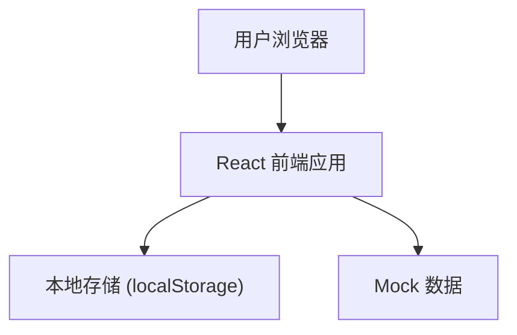
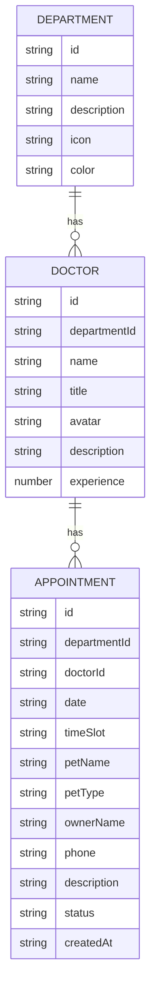

## 1. 架构设计



## 2. 技术描述

- 前端框架：React@18 + TypeScript
- 构建工具：Vite@5
- 样式方案：Tailwind CSS@3
- 路由管理：React Router DOM@6
- 状态管理：React Context + useReducer
- 图标库：Lucide React
- 数据存储：localStorage（本地持久化预约记录）
- Mock 数据：内置科室、医生、时间段数据

## 3. 路由定义

| 路由 | 页面 | 功能 |
|------|------|------|
| / | 首页 | 医院介绍、热门科室展示 |
| /booking | 预约挂号页 | 科室选择、医生选择、时间段选择、预约提交 |
| /my-appointments | 我的预约页 | 预约记录列表、取消预约 |

## 4. 数据模型

### 4.1 数据模型定义



### 4.2 TypeScript 类型定义

```typescript
interface Department {
  id: string;
  name: string;
  description: string;
  icon: string;
  color: string;
}

interface Doctor {
  id: string;
  departmentId: string;
  name: string;
  title: string;
  avatar: string;
  description: string;
  experience: number;
}

interface Appointment {
  id: string;
  departmentId: string;
  doctorId: string;
  date: string;
  timeSlot: string;
  petName: string;
  petType: string;
  ownerName: string;
  phone: string;
  description: string;
  status: 'pending' | 'completed' | 'cancelled';
  createdAt: string;
}

interface BookingState {
  selectedDepartment: Department | null;
  selectedDoctor: Doctor | null;
  selectedDate: string | null;
  selectedTimeSlot: string | null;
}
```

## 5. 项目目录结构

```
src/
├── components/
│   ├── Navbar.tsx          # 顶部导航栏
│   ├── DepartmentCard.tsx  # 科室卡片
│   ├── DoctorCard.tsx      # 医生卡片
│   ├── TimeSlot.tsx        # 时间段选择
│   ├── AppointmentCard.tsx # 预约记录卡片
│   └── StepIndicator.tsx   # 步骤指示器
├── pages/
│   ├── Home.tsx            # 首页
│   ├── Booking.tsx         # 预约挂号页
│   └── MyAppointments.tsx  # 我的预约页
├── context/
│   └── AppointmentContext.tsx  # 预约状态管理
├── data/
│   ├── departments.ts      # 科室 Mock 数据
│   └── doctors.ts          # 医生 Mock 数据
├── types/
│   └── index.ts            # TypeScript 类型定义
├── App.tsx                 # 根组件
├── main.tsx                # 入口文件
└── index.css               # 全局样式
```

## 6. 核心技术决策

1. **状态管理**：使用 React Context + localStorage 实现预约数据的全局管理和本地持久化
2. **路由方案**：React Router DOM 6 实现单页应用路由切换
3. **样式方案**：Tailwind CSS 3 实现响应式布局和主题定制
4. **UI 组件**：自定义组件库，保持设计风格统一
5. **动画效果**：CSS transitions + Tailwind 动画类实现平滑过渡
6. **数据持久化**：预约记录存储在 localStorage，刷新页面不丢失
